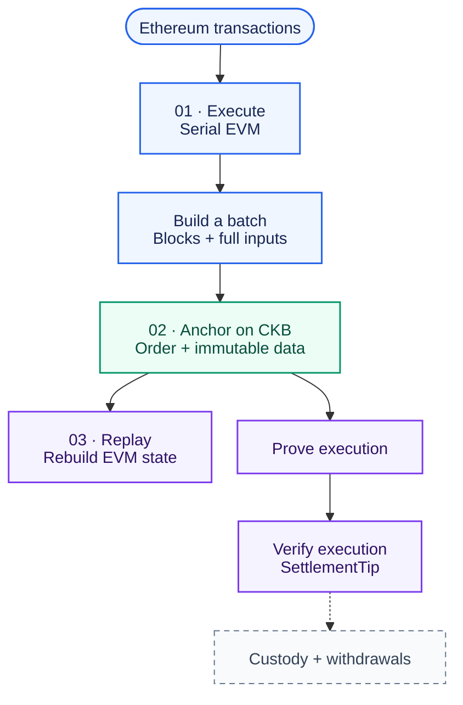
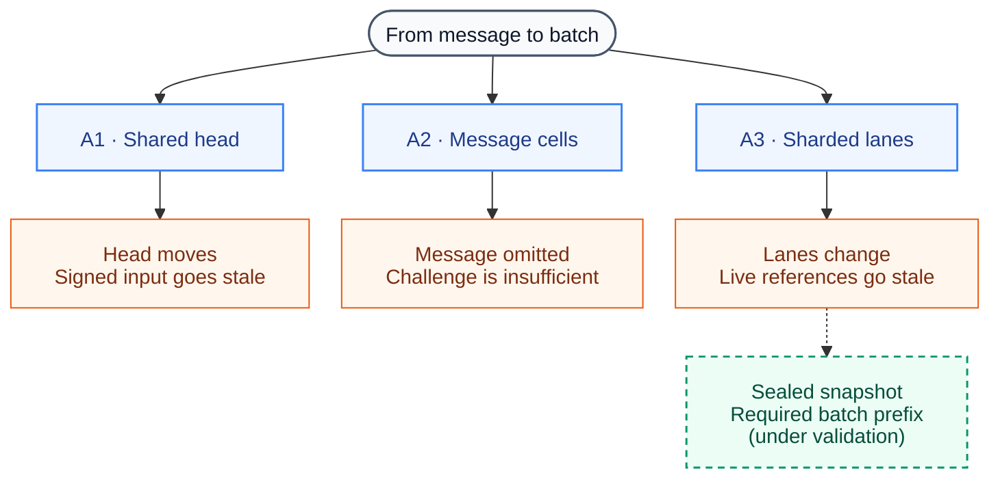

# Tactus O1

**Ethereum execution. CKB ordering. A path toward verifiable settlement.**

Tactus O1 is an EVM validity rollup being built on CKB. It runs Ethereum
transactions off-chain and publishes their ordered inputs on CKB, so another
operator can reconstruct what happened. The goal is to make both transaction
ordering and settlement independent of any one operator.

This repository contains the Rust implementation, protocol specifications, and
experiments testing that goal under competition, censorship, and chain reorgs.

> **Still under development.** Local execution, data publication, and recovery
> and real proof-verified SettlementTip transitions have working implementations
> and test evidence. Production admission, custody and safe exits remain unfinished. Tactus O1 is **not ready
> for production or user funds**. See the [readiness tracker](specs/PRODUCTION_READINESS.md).

[Architecture](specs/TACTUS_O1_ARCHITECTURE_SPEC_v0.2.6.md) ·
[Experiments](specs/EXPERIMENT_A_DESIGN.md) ·
[Execution](specs/EXECUTION_V1.md) ·
[Read-only RPC](specs/OBSERVER_RPC_REPORT.md) ·
[Readiness](specs/PRODUCTION_READINESS.md)

## Follow a transaction

A builder executes transactions and packages one or more EVM blocks into a
batch. CKB establishes the canonical batch order and stores the complete inputs
needed for replay. A real proof-and-settlement path verifies the resulting state and advances a
canonical SettlementTip. Asset custody and withdrawals still require a bridge
and independently verified release rules.



**Solid paths** have local implementation evidence. **Dashed paths** are still
being built; the diagram is not a claim of a complete production system.
A CKB anchor records order and data. It does not, by itself, prove EVM execution
or make a soft confirmation final.

O1 keeps its reconstruction data on CKB. External data availability, parallel
execution, and optional fast confirmations are separate research directions;
they are not prerequisites for the initial design.

## What you can try today

- **Execute and replay Ethereum transactions.** The serial `revm` executor uses a
  pinned Shanghai profile, with state roots, receipts, and rejection outcomes
  checked against independent Geth fixtures.
  [Execution evidence →](specs/EXECUTION_DIFFERENTIAL_REPORT.md)
- **Publish complete batch inputs on CKB.** Experimental scripts enforce bounded,
  atomic data publication. Devnet tests exercise invalid inputs and recovery
  after a planned chain reorg.
  [Batch publication results →](specs/BATCH_INPUT_REPORT.md)
- **Rebuild EVM state in another process.** Recovery reads canonical CKB inputs
  and replays execution. A durable local journal also supports restart and
  corruption checks.
  [Recovery results →](specs/CKB_EVM_RECOVERY_REPORT.md)
- **Test competing and uncooperative builders.** Deterministic simulations and
  isolated CKB devnets expose stale references, message omission, and the limits
  of challenge-only enforcement.
  [Devnet results →](specs/EXPERIMENT_A_DEVNET_REPORT.md)

## The hard question: can a builder ignore you?

Accepting a message is only half the problem. If every builder refuses to
process it, the protocol needs an enforceable route forward. **Experiment A**
compares three ways to admit messages and make them part of the canonical order.



The results explain where the work is going: higher fees cannot repair a stale
reference, and penalties alone cannot make an omitted message execute. Sealed
snapshots offer a way to keep batch inputs stable while new messages arrive,
but snapshot switching and mandatory processing must survive hostile conditions.

Read the [simulation report](specs/EXPERIMENT_A_REPORT.md), the
[A2 challenge counterexample](specs/A2_OBLIGATION_REPORT.md), or the
[A3 sealed-snapshot design](specs/A3_SEALED_V1.md) and its
[mandatory-gate node experiments](specs/A3_SEALED_REPORT.md). Simulation assumptions are
recorded separately from real-node evidence; full Experiment A remains open.

## Run it locally

Start with the deterministic experiment. It needs no running CKB node.
The repository pins **Rust 1.92.0** through `rust-toolchain.toml`; use a
Rust installation managed by `rustup`.

```bash
cargo run --locked --bin tactus-o1-experiment-a
```

To run the workspace tests:

```bash
cargo test --locked --workspace
```

For real transaction-pool and CKB-VM experiments, install **CKB 0.210.0** and
have Bash and Python 3 available. The launcher builds the RISC-V scripts and
creates a fresh, funded local chain:

```bash
CKB_BIN=/absolute/path/to/ckb scripts/run-devnet-experiments.sh
```

The launcher uses loopback ports `18714` and `18715`, saves logs and evidence
under `artifacts/`, and stops its own node when finished. Its fixed keys belong
only to these disposable devnets. Development and CI target CKB **0.210.0**;
point `CKB_BIN` at that version’s binary.
See [local validation](specs/PRODUCTION_READINESS.md#local-validation) for more details.

## Find your way around

| If you want to… | Start here |
| --- | --- |
| Understand the protocol and its trust assumptions | [Architecture specification](specs/TACTUS_O1_ARCHITECTURE_SPEC_v0.2.6.md) |
| Follow the A1 / A2 / A3 comparison | [Experiment A design](specs/EXPERIMENT_A_DESIGN.md) |
| Understand exactly what an EVM batch means | [Execution rules](specs/EXECUTION_V1.md) and [batch input format](specs/BATCH_INPUT_V1.md) |
| Work on restart and recovery | [Execution journal](specs/EXECUTION_JOURNAL.md) and [CKB-to-EVM recovery](specs/CKB_EVM_RECOVERY_REPORT.md) |
| See what still blocks deployment | [Production readiness](specs/PRODUCTION_READINESS.md) |

The code follows the same boundaries: `crates/tactus-o1-execution/` handles EVM
execution and replay, `crates/tactus-o1-protocol/` defines shared primitives, and
the script crates enforce experimental CKB transitions. The experiment and
devnet-driver crates exercise those pieces; `scripts/` builds and runs the lab.
Wire formats and protocol rules live in `specs/`.

<details>
<summary>Further reading: fast confirmations, external DA, and future scaling</summary>

- [Operational posture](specs/OPERATIONAL_POSTURE.md) — builders, soft blocks,
  and what a fast confirmation can promise.
- [DAG and execution research](specs/DAG_ACCELERATION_NOTE.md) — where
  parallelism might help and why canonical ordering stays linear.
- [O2 activation policy](specs/O2_ACTIVATION_POLICY.md) — the conditions for a
  future external-DA domain, Tactus Pulse.

</details>
