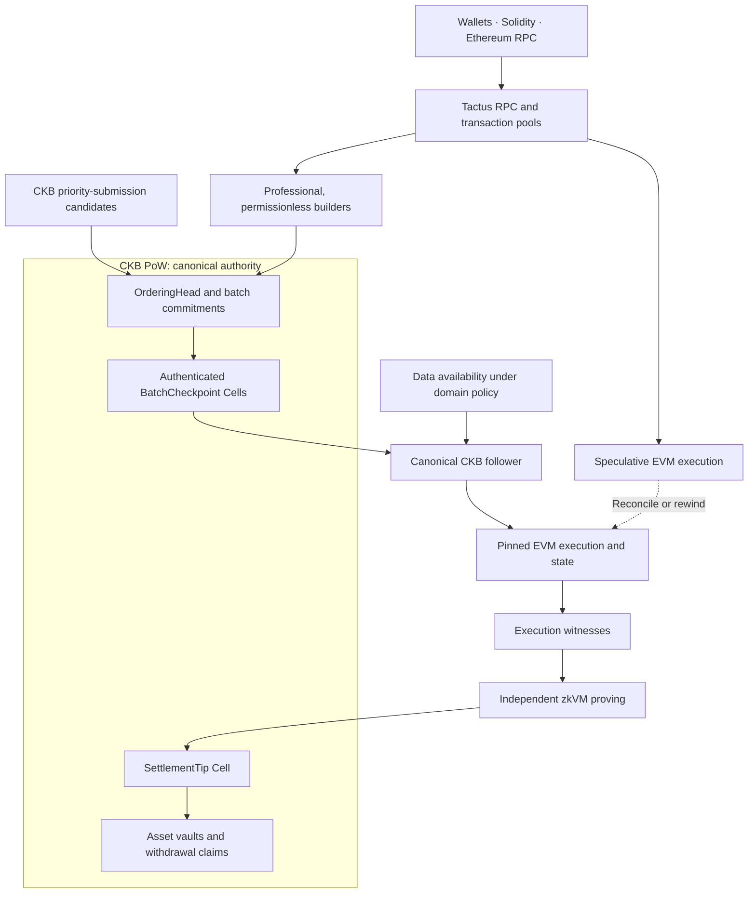
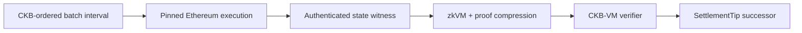

# Tactus Architecture Specification

**Version:** 0.2.6  
**Status:** Architecture baseline / research specification — **not** implementation evidence or production authorisation  
**Date:** 9 October 2026  
**Project:** Tactus  
**Default deployment:** CKB-based EVM validity rollup with CKB data availability (O1)  
**Scalability extension:** Separately secured external-DA validity domain (O2)  
**Research alternative:** Bounded optimistic CKB-VM adjudication (O3)  
**Parked:** Optimistic settlement plus external DA (O4)

> **Project rename (9 October 2026):** the project formerly designated *Weft* is now **Tactus** — many independent voices, one shared beat, no conductor. All occurrences have been renamed; the technical content of this frozen baseline is unchanged, and the version remains v0.2.5.

> **Protocol thesis.** Execute Ethereum transactions off-chain for performance; allow professional but non-privileged builders to assemble candidate batches; use CKB PoW and Cell transitions for canonical batch succession; settle only validity-proven EVM state transitions; preserve the data and witnesses required for the security domain's stated recovery guarantees.

## 0. Status, change control and claims

This document is the **integrated successor to v0.2.1**, incorporating the priority-admission and acceptance-gate amendments from the subsequent design reviews. Where a property has not been demonstrated, the text says **OPEN** or **HYPOTHESIS**.

**Changes in v0.2.2:**

1. Freeze the singleton `OrderingHead` as a **safety/reference implementation**, not the final production admission design.
2. Define two competing Priority Inbox candidates: **A1 atomic head admission** and **A2 independent Priority Message Cells with ex-post challenges**. Explicitly separate admission, processing, retrospective liability and enforceable inclusion.
3. State that an unconsumed Message Cell does **not** itself prove omission from EVM execution, and that a penalty does **not** itself cause inclusion.
4. Make permissionless proving, upgrade constraints and operator-independent withdrawals first-class security gates.
5. Adopt **G1–G9 evidence gates**, distinguishing protocol, operational and measured product claims.
6. Replace historic Godwoken-relative TPS as the acceptance criterion with **absolute sustained settled TPS, per-transaction DA bytes and cost, latency distributions and prover economics**. Godwoken remains historical context, not a mandatory benchmark opponent.
7. Define O2 as a conditional, separately secured scalability configuration; no per-batch DA switch over one unrestricted global EVM state.
8. Preserve checkpoint provenance and live-dependency requirements without treating the existence of a `cell_dep` as proof of correct batch history.

**Changes in v0.2.3 (A2 bounded-processing and obligation amendments):**

9. Upgrade A2 input-bloat guidance to **binding protocol constraints**: `max_priority_inputs`, `max_priority_bytes`, `max_priority_cycles` and `max_priority_gas` MUST all be enforced; script-group amortisation is a measured effect, not an assumed saving (§5.3.1).
10. Require **authenticated carry-forward**: outstanding priority obligations must be represented as an authenticated outstanding set, never as an aggregate count; the protocol MUST fix either a deterministic processing policy or an enforceable per-message deadline policy (§5.3.1).
11. Distinguish **`Admitted → Included → Proven`** for priority messages: consumption of a Message Cell MUST leave an authenticated inclusion obligation until the corresponding state transition is settled, with recovery that cannot double-execute across resequenced canonical histories (§5.3.1).
12. Record the **accumulator search conclusion**: under CKB Script visibility constraints, an authenticated global pending-set without shared enqueue state appears blocked; the viable corners are sharded FIFO lane heads with a deterministic merge duty (A3′) or per-message deadline liability (§5.4).
13. Extend Experiment A with **input-saturation, carry-forward-starvation and consumed-but-unproven** adversarial cases (§14.3).

**Changes in v0.2.4 (correction release — no architectural changes; baseline status carried over from v0.2.3):**

14. Resolve the §5.3.1/§5.4 policy contradiction: at least one enforceable **primary** processing policy is required; deterministic ordering and per-message deadline remedies MAY be combined where their interaction is unambiguous (§5.3.1).
15. Add the **Priority Message Lock** requirement: protocol-controlled consumption via processing, cancellation or challenge transitions only (§5.3).
16. Close the consumed-but-unproven recovery clause into two failure classes, with inheritable Obligation Cells for the canonical-but-unsettled case and its settlement-liveness coupling to §8 (§5.3.1).
17. Redefine input saturation as **priority backlog saturation** (`λ_priority > μ_processing`) with backlog, deadline-violation and stability-recovery measurements (§14.3–14.4).
18. Promote A3′ to an independently tested candidate and record the **live-dependency freshness construction** with its proof obligations (§5.4, §14).
19. Fix the stale version reference in §10.2.

**Changes in v0.2.6 (editorial — removal of Myelin as a reference):**

25. Remove Myelin as a reference and as a research-provenance mention. Per project decision it may appear only as one competitor for the optional O2 external-DA adapter slot, judged by the O2 activation policy's evidence gate (`specs/O2_ACTIVATION_POLICY.md`).

**Changes in v0.2.5 (experiment-scope amendments and consistency fixes — architecture frozen at the v0.2.4 baseline; no architectural changes):**

20. Record A3′ **read-dependency amplification**: the live-cell-dependency rule that provides freshness also invalidates pending batch anchors on lane-head updates; reframe the decisive question as **freshness versus batch-anchor liveness**, and note the dependency-churn censorship vector (§5.4).
21. Add **epoch-sealed lane snapshots** as the designated comparison construction for the churn experiments, with its open questions (post-seal mandatory latency, switching-schedule abuse, snapshot retention) (§5.4).
22. Distinguish **individual obligation authenticity** from **global outstanding-set completeness**; deadline-only A2 provides the former and MUST NOT be presented as the latter (§5.3.1).
23. Add the **cross-lane dependency-churn** adversarial test group with the dual-throughput requirement — priority admission throughput and canonical batch progression throughput must be measured together (§14.4–14.6).
24. Consistency: §14.5 outcomes extended to three candidates; W-01/W-11 updated for A3′ and dependency churn.

**Claim discipline.** A design goal must not be presented as an implemented protocol property. A local fixture passing must not be presented as a public-network security result. A soft confirmation must not be presented as settled finality. A service-cost estimate must not be presented as measured sustained throughput.

### 0.1 Normative language

- **MUST:** condition required for the named protocol property; failure invalidates the corresponding claim.
- **SHOULD:** recommended design rule; exceptions need an explicit justification.
- **MAY:** optional feature.
- **OPEN:** unresolved design/feasibility problem that blocks the relevant security claim.
- **REFERENCE:** a correctness-first construction to be tested, not necessarily the production construction.

### 0.2 Architecture decisions

| Decision | Baseline |
|---|---|
| Project boundary | Tactus is a standalone protocol; no external consensus or runtime dependency is required. |
| Authoritative ordering | CKB canonical chain and permissionless, script-validated batch succession. |
| Candidate ordering | Professional batch builders may specialise, but have no exclusive canonical authority. |
| Execution | A pinned Ethereum execution specification using mature Reth/revm components. |
| Settlement | Proof-validated state transitions on CKB; O1 is the primary safety reference. |
| Data availability | O1 publishes sufficient reconstructable data on CKB. |
| Throughput extension | O2 is a separate state/security domain or deployment with external DA. |
| Optimistic research | O3 explores CKB-VM-bounded fraud proofs independently. |
| Parked configuration | O4 is excluded from the active scope pending availability-aware dispute and recovery guarantees. |

## 1. Objectives, non-objectives and decentralisation model

### 1.1 Objectives

Tactus aims to provide Ethereum-compatible contract execution; permissionless canonical batch proposals; CKB-enforced continuity of batch history; a usable L1 priority-submission path; explicit and measurable execution/DA/proving costs; proof-enforced settlement; reproducible state reconstruction under the declared DA policy; custody conservation; and independent withdrawal/recovery mechanisms.

### 1.2 Non-objectives

Tactus does not seek a second L2 validator consensus, a committee with exclusive sequencing rights, automatic MEV elimination, identical Ethereum L1 block metadata, unrestricted cross-DA-domain atomic contract calls, guaranteed economic finality from a builder preconfirmation, or effortless migration of a live validity settlement system to an optimistic one.

### 1.3 Five powers and their boundaries

| Power | Permitted actor | Protocol authority |
|---|---|---|
| Transaction intake | Any RPC/mempool operator | None; a gateway can be bypassed. |
| Candidate batch ordering | Any eligible professional or independent builder | Proposes an internally ordered batch, not canonical finality. |
| Canonical batch succession | CKB PoW + authorised OrderingHead transition | Authoritative for the current canonical chain, subject to PoW reorganisation. |
| State correctness | Independently generated proof + CKB verifier | Only proof-accepted transitions advance SettlementTip. |
| Data custody/retention | CKB or explicit external DA operators | Defined by DA policy; a hash alone is not retrievability. |

**Protocol requirement:** no privileged service should be necessary to *authorise* a valid canonical batch transition, produce an accepted proof or exercise an otherwise valid withdrawal claim.

**Decentralisation is constrained by the weakest privileged role able to defeat a user guarantee.** In particular, permissionless batch proposals do not compensate for unilateral verifier upgrades, unavailable state witnesses, a sole operational prover, or an exit path requiring a private operator signature. These are separately tested.

## 2. Architecture and state planes



The architecture distinguishes three execution statuses:

1. **Speculative head:** accepted/executed locally; may be replaced.
2. **Canonical-ordered head:** reconstructed from CKB-accepted batch ordering; may change under CKB reorganisation.
3. **Proven settlement head:** highest contiguous state accepted by the CKB settlement verifier; still subject to CKB's probabilistic chain finality.

A provider may offer a fast preliminary confirmation, but it does not create canonical or proven settlement authority. RPC methods, indexer views and wallets must identify these statuses unambiguously.

## 3. Identity, encoding and common batch contract

### 3.1 Genesis identity

A deployment MUST have an unambiguous `rollup_id`, genesis execution state, CKB network identity, authorised ordering/settlement/vault scripts and domain DA policy. A second authorised genesis claiming the same identity MUST be prevented by a documented uniqueness mechanism. A Type-ID-derived construction is a candidate, not a finished proof.

Consensus-critical data MUST use canonical, versioned binary encodings with fixed test vectors. JSON field order must never affect a protocol commitment. Commitments must be domain separated; conversion between 256-bit digests and proof-system field elements must be injective over the relevant encoded domain or explicitly constrained against collision.

### 3.2 Reference objects

```text
OrderingHead {
    rollup_id, protocol_version,
    next_batch_number, batch_accumulator_root,
    inbox_root, inbox_tail, processed_inbox_cursor,
    execution_rules_hash,
    da_policy_id  // immutable ordinary-transition domain parameter
}

BatchManifest {
    rollup_id, protocol_version,
    batch_number, parent_batch_commitment,
    ordered_transactions_root,
    inbox_cursor_before, inbox_cursor_after,
    data_commitment, data_encoding_version, da_policy_id,
    execution_rules_hash, gas_limit, resource_limits_commitment
}

BatchCheckpoint {
    rollup_id, batch_number, cumulative_batch_root,
    batch_commitment, ordering_protocol_version
}

SettlementTip {
    rollup_id, settlement_protocol_version,
    proven_batch_cursor, ethereum_state_root, withdrawal_root,
    execution_rules_hash, proof_system_id,
    verification_key_commitment
}
```

These are **illustrative field sets**, not executable structures or an approved Molecule schema.

The batch accumulator must authenticate **an ordered sequence**, not unordered set membership. An interval proof must establish correct contiguous range, predecessor and end commitment. The choice between incremental Merkle accumulator, MMR or another authenticated append-only structure is OPEN and must be benchmarked in CKB-VM.

### 3.3 Batch admission and total execution semantics

CKB batch admission and EVM execution are different verification layers. The ordering script does not run a complete EVM batch. However, it MUST restrict admitted input envelopes and resource limits so that all accepted inputs have deterministic semantics.

A reverted EVM transaction is a valid, chargeable execution outcome; an invalid or unauthorised priority envelope must have a separately defined rejection or system-message outcome. Accepted inputs must not introduce an unbounded, unprovable batch which permanently traps the settlement frontier.

## 4. OrderingHead: correctness reference (A1)

The **A1 reference** stores priority queue root and cursor within the single consumed OrderingHead. It is retained because it makes the current append frontier and current processing cursor part of one atomic canonical state.

`ENQUEUE` and `APPEND_BATCH` both consume and recreate this head. Ordinary Ethereum transactions do **not** use `ENQUEUE`; they travel through off-chain Tactus gateways and builders. The priority channel is a censorship-recovery path.

### 4.1 ENQUEUE transition

A valid `ENQUEUE` MUST authenticate the message envelope; enforce byte/gas/message-count bounds and a non-zero admission-price/bond policy; append the correct ordered queue commitment; increase `inbox_tail` exactly; leave the canonical batch counter and processed cursor unchanged; and preserve all genesis-bound fields.

Capacity released/allocated by the consumed Cell must be accounted for precisely. Public permission to submit does not imply public permission to drain the OrderingHead's CKB capacity.

### 4.2 APPEND_BATCH transition

A valid `APPEND_BATCH` MUST authenticate the predecessor; increment the batch number exactly once; extend the canonical batch accumulator; bind exact ordered transactions and available payload; and advance the processed priority cursor only over an authenticated contiguous prefix permitted by protocol maturity and resource rules.

No builder signature or closed-validator certificate may be required merely to obtain the exclusive *right* to propose the next batch.

### 4.3 Safety is not liveness

CKB single-consumption prevents two conflicting successors being accepted in the **same canonical chain**. It does not guarantee that any particular valid proposed spend reaches the chain.

The critical A1 failure is **admission starvation**: a user reads head `H`, signs an `ENQUEUE`, but a professional builder has already advanced to `H'`. The user's transaction can arrive dead-on-arrival, regardless of its higher fee rate. Repeating this may starve ordinary wallet users while a dominant builder quickly regenerates valid descendants.

Fee-rate competition matters **among simultaneously eligible spends of the same live head** but does not solve already-stale OutPoints. Tactus MUST NOT claim bounded user admission solely from CKB fee bidding.

Accordingly A1 is **FROZEN AS SAFETY REFERENCE ONLY**, not selected as the final production priority-entry design.

## 5. Priority Inbox alternatives and inclusion properties

Tactus distinguishes four independent operations:

1. **Admission:** a priority-message identity becomes part of a CKB-verifiable submission set/queue.
2. **Processing:** that message has a protocol-authenticated deterministic execution outcome within a canonical batch.
3. **Liability:** an operator/bonded party can be sanctioned for a precisely attributable missed duty.
4. **Forced inclusion:** a user has a permissionless, effective path that eventually advances the canonical execution process despite an uncooperative dominant builder, under the expressly stated CKB inclusion assumptions.

**Retrospective liability is not forced inclusion.** Neither a penalty transaction nor a valid Message Cell guarantees that an EVM transaction has been incorporated into the canonical state.

### 5.1 Shared priority invariants

- **PRI-1: Identity.** Each priority message has a unique, domain-bound, authenticated commitment and replay policy.
- **PRI-2: Prefix/processing integrity.** Canonically processed messages satisfy the selected ordering/queue semantics, with no silent duplication or omission.
- **PRI-3: Freshness.** A batch may not use an authentic but stale queue observation to evade obligations already mandatory under the selected protocol.
- **PRI-4: Deterministic outcome.** A syntactically admissible message has a bounded valid execution, failure or rejection outcome.
- **PRI-5: Recovery.** Reorgs, conflicting spends and abandoned builders cannot generate inconsistent accepted processing history.
- **PRI-6: Admission liveness (OPEN).** Ordinary users can get an authenticated submission recorded under a defined hostile-builder/miner model.
- **PRI-7: Enforceable inclusion (OPEN).** A permissionless process can advance overdue messages without the dominant builder's authorisation.

No priority design passes the censorship-resistance gate solely because it satisfies PRI-1 through PRI-5.

### 5.2 A1 — atomic OrderingHead admission

A1 jointly linearises inbox append and batch processing through the same Cell. Its safety and freshness properties are relatively easy to state, but competing builders may starve user ENQUEUE transactions by repeatedly consuming the head before wallet transactions arrive.

Test A1 as the **correctness baseline** and record the starvation counterexamples.

### 5.3 A2 — independent Priority Message Cells and ex-post challenge (EXPERIMENTAL)

A user MAY create an independently funded, type-script-validated `PriorityMessageCell` without consuming the OrderingHead:

```text
PriorityMessageCell {
    rollup_id, unique_message_id, envelope_commitment,
    admissibility_policy_id, resource_limit,
    submission_epoch_or_chain_condition,
    processing_deadline_policy,
    funding_or_bond_terms
}
```

The design removes *admission-time competition for the OrderingHead*, but it introduces a harder question: how can a CKB script verify that the builder has accounted for every applicable independently published message without enumerating historical outputs?

**Crucial non-implication:** a currently live Message Cell only proves it has not been consumed as an input in the current canonical history. It does **not** by itself prove the message was omitted from an EVM batch. That inference requires an enforced one-to-one rule connecting authenticated message consumption to batch processing; and consumption alone does not prove correct EVM execution.

One candidate is to require an accepted processing transaction to consume the corresponding Message Cell and bind its identity to a canonical batch manifest, later verified by the execution proof. This makes duplicate processing observable through consumed Cells but creates transaction-size, batching and Cell-dependency costs that must be measured.

Another candidate is a challenge-right construction: after a CKB-verifiable maturity condition, a claimant spends a still-live Message Cell, references an authenticated batch checkpoint and initiates a challenge that creates a **positive duty to disclose/process or supply evidence**. This requires:

- A deadline that CKB scripts can check through consensus-visible conditions (not an operator's wall clock).
- Cryptographic proof that the challenged obligation was actually due.
- Correct attribution of liable funds/bonds, with resistance to proposer identity rotation and Sybil avoidance.
- A challenge state that **affects relevant settlement or batch transitions**. Merely creating a Challenge Cell does not notify all other scripts; CKB scripts cannot scan all unspent challenges.
- A mechanism that actually progresses an eligible message when the dominant builder refuses, if claiming **forced inclusion** rather than only punishable censorship.

If the challenge only slashes a bond, A2 provides *retrospective accountability* but not a processing guarantee. Who is liable is also OPEN in permissionless multi-builder operation: the last proposer, the proposer that crossed a stated deadline, or a separately bonded service cannot be assumed interchangeable.

**Lock authorisation (implementation-blocking requirement).** Type-script validation constrains state transitions; it does not by itself authorise consumption — in CKB the *lock* decides who may spend a Cell. A user-signature lock would prevent builders from processing messages without per-message signatures; an anyone-can-spend lock would let a griefer destroy message obligations outright. A2 therefore requires a **protocol-controlled Priority Message Lock**: permissionless consumption only through authenticated protocol transitions — processing (within a compliant `APPEND_BATCH`), cancellation (under user-authorised, consensus-verifiable conditions), or challenge/expiry (per the deadline policy). No ordinary transaction may burn a message obligation. The exact conditions of each path are part of the A2 specification work and are exercised in §14.3.

### 5.3.1 Bounded processing, carry-forward and inclusion obligations (normative)

An `APPEND_BATCH` transition that processes independent Priority Message Cells MUST enforce all of the following bounds **simultaneously**:

| Constraint | Enforces |
|---|---|
| `max_priority_inputs` | number of consumed Message Cells per batch |
| `max_priority_bytes` | serialized input and witness burden |
| `max_priority_cycles` | aggregate lock/type verification cost |
| `max_priority_gas` | EVM execution resources requested by the processed messages |

Admission pricing does not substitute for these hard bounds. A technical qualification applies: N consumed cells do not necessarily imply N independent CKB-VM script executions, because CKB groups inputs by **full script identity (code hash, hash type and args)** — identical locks may amortise within one group — but cells carrying distinct user lock arguments can still form many groups. Script-group amortisation is therefore a property to be **measured**, never an assumed saving.

**Obligation continuity.** Independent Message Cells do not by themselves constitute a globally ordered queue. If a bound leaves messages outstanding, carrying them forward REQUIRES an **authenticated representation of which messages remain outstanding** — an aggregate `carry_forward_count` proves nothing about identity. The protocol MUST define at least one **enforceable primary processing policy**:

- a **deterministic processing policy**: an authenticated pending-set with a monotonic cursor, expressing contiguous-prefix obligations directly, at the cost of shared or sharded queue state; or
- a **per-message deadline policy**: each Message Cell carries a consensus-verifiable maturity and deadline; crossing a deadline without processing creates individually attributable liability.

Deterministic ordering and per-message deadline remedies MAY be combined — as in A3′, where lane FIFO is the ordinary rule and deadline challenges act as the anti-starvation backstop — provided their interaction is unambiguous and each rule remains independently enforceable.

**Two levels of guarantee.** *Individual obligation authenticity* — verifying a specific message's identity, maturity and deadline — is distinct from *global outstanding-set completeness* — verifying the entire set of pending messages. A deadline-only A2 configuration provides the former (individually enforceable claims) and MUST NOT be presented as the latter (a strict FIFO queue); completeness claims require the shared or sharded authenticated pending-set of a deterministic policy. This distinction is part of G2 evidence, not a footnote.

Builders MUST NOT be able to present nominal processing activity by repeatedly selecting favourable subsets of pending messages while others pass their deadlines (§14.3, carry-forward starvation).

**Consumption is not execution.** A consumed Message Cell is no longer live before its payload's EVM execution is proven. Tactus MUST distinguish three stages for priority messages: **`Admitted → Included → Proven`**. Consumption of a Message Cell within an accepted batch creates an authenticated **Pending Inclusion Record** binding the message identity to its batch interval; the obligation persists until that interval is settled. Recovery MUST distinguish two failure classes:

| Failure | Required handling |
|---|---|
| A CKB reorganisation removes the including batch | Roll back and reconstruct canonical obligations; the consumed Cell may re-enter the live set on the alternate history. |
| The batch remains canonical but cannot be settled | The consumed Message Cell is dead and cannot be re-consumed; recovery requires the protocol to mint an inheritable **Obligation Cell** — or an authenticated cancel/compensate/re-queue transition — so the obligation survives without double execution. |

The second class is the harder one: a canonical-but-unprovable batch also blocks the contiguous proven cursor, so message-level recovery alone cannot restore settlement liveness; this couples to the admission-totality requirement of §8 and remains part of W-12. Any recovery path MUST NOT execute the same authenticated message twice across distinct canonical histories (consistency with PRI-1/PRI-2).

A2 remains an **experimental candidate**, and MUST NOT supersede A1 as the reference until its processing bounds, carry-forward representation, deadline-or-order policy, challenge linkage, liability attribution, inclusion-record lifecycle and enforceable-progress rules (§5.3.1) are specified and tested.

### 5.4 A3 — partitioned inboxes (research only)

Independent append lanes might distribute admission contention. A deterministic merge manifest could impose a round-robin or another canonical obligation across lanes. However, lane freshness and globally complete processing must be verifiable without trusting an off-chain indexer. A3 is a parameterised design hypothesis, not a solved queue.

**A3′ refinement.** Lanes may each maintain a small authenticated **lane-head cell** — effectively a per-lane mini-OrderingHead — whose append consumes only that lane's head, together with a deterministic cross-lane merge duty (for example, strict round-robin over lane frontiers) enforced at `APPEND_BATCH`, and per-message deadline challenges as the cross-lane anti-starvation backstop. Contention is amortised over the lane count while contiguous-prefix obligations remain expressible per lane.

**A3′ live-dependency freshness construction (to be tested).** `APPEND_BATCH` consumes only the OrderingHead and references each scheduled lane's current head through `cell_deps` (read-only; a CellDep must resolve to a live Cell). If each lane's genesis identity is unique and a lane-head update must consume its predecessor, then exactly one live head exists per lane, and a dependency on it is necessarily a dependency on the *latest* state — a consumed stale head cannot serve as a valid dependency. Freshness therefore follows from live-cell uniqueness rather than enumeration, which is a materially stronger guarantee than any off-chain indexer snapshot. Proof obligations before A3′ may be considered viable: a builder must not be able to omit a scheduled lane; old/new accumulator roots must correctly authenticate message history; the fixed lane count must not impose unacceptable `cell_deps` costs; and cross-lane processing order and maturity deadlines must be CKB-script-verifiable. A3′ is an **independently tested candidate** in Experiment A (§14), not merely a footnote to A2.

**A3′ read-dependency amplification (liveness risk).** The same rule that provides freshness also makes batch anchors fragile: because a `cell_deps` reference must resolve to a live Cell, a single lane-head update invalidates every pending `APPEND_BATCH` that references the previous head. Under a simple independent-update sensitivity model, the probability that all referenced lane heads remain unchanged across a construction-to-commit interval Δt falls roughly as `e^(−Δt·Σλᵢ)`, where `λᵢ` is lane *i*'s update rate. Increasing the lane count therefore improves admission parallelism while increasing batch-invalidation exposure — and an adversary need not control any builder: continuous valid enqueues across lanes can systematically obstruct canonical batch progression (a **dependency-churn censorship vector**). The decisive A3′ question is thus not freshness alone but **freshness versus batch-anchor liveness**, carried by a dedicated adversarial test group (§14.6).

**Epoch-sealed lane snapshots (comparison construction).** A candidate mitigation is to reference immutable sealed snapshots rather than continuously changing active heads: users enqueue against the active head as usual; at protocol-defined switching points the active head is sealed into an immutable snapshot, and builders reference the sealed snapshot. Churn then affects only the active head, not the anchors under construction. This is not a ready answer — post-seal messages must become mandatory under bounded delay, builders must not be able to abuse the switching schedule, and snapshot retention must not recreate the GC hazards of §6 — but it is the designated comparison arm for the churn experiments of §14.6.

**Accumulator search conclusion (design guidance).** The construction sought in review — a globally authenticated "earliest pending" set with **no shared enqueue state at all** — appears blocked by the same CKB Script visibility limitation recorded in §5.3: completeness of a live-cell set is negative knowledge and cannot be verified inside a transition. Experiment A should therefore treat **A3′ (sharded FIFO heads with a deterministic merge duty)** and **A2 with per-message deadlines** as the two realistic corners of the priority-inclusion design space, rather than expecting a contention-free global FIFO accumulator.

### 5.5 Admission pricing

Any selected priority design MUST impose bounded resource obligations and a non-zero, enforceable charging/funding scheme. It must address message-byte fees, maximum requested EVM gas, replay and duplicate submissions, CKB capacity costs, refunds and builder/prover processing compensation.

A message-cost policy cannot confer exclusive proposal privileges. An unbounded zero-cost priority right is unacceptable because it can impose sustained processing obligations on every subsequent batch.

## 6. BatchCheckpoints and structural ordering evidence

An OrderingHead `APPEND_BATCH` transaction SHOULD produce an authenticated `BatchCheckpoint` output or another append-only proof object under a script-enforced creation rule. A plausible hash in arbitrary Cell data is not a valid checkpoint.

A settlement transaction MAY name an authenticated live checkpoint through `cell_deps`. In the CKB validating chain, a CellDep must resolve to an existing live Cell; a reorganisation that removes the referenced creation history without restoring the dependency invalidates a settlement transaction that still depends on it.

**Bounded claim:** this provides *structural dependency on canonical-chain existence*, not independent proof that the checkpoint's claimed ordered-root is genuine. That requires script-enforced provenance, genesis-bound identity, accumulator verification and version-consistent interval membership.

A valid settlement MUST verify the proven batch interval belongs to a contiguous authenticated canonical history. Merely relying on an off-chain indexer's `latest_batch_root` is prohibited.

Checkpoint retention and garbage collection are protocol operations: consuming a checkpoint may break still-pending settlement references. The initial profile SHOULD retain checkpoints while unsettled proof intervals or recovery obligations refer to them. Future GC requires a proof that relevant replacement commitments and claims remain available, plus a capacity-funding policy.

## 7. Ethereum execution and confirmation semantics

Tactus SHOULD build on pinned Reth/revm components rather than implement a proprietary EVM interpreter. The protocol MUST define exact fork rules, transaction envelopes, signatures, nonce/account/storage semantics, logs and receipts, gas and refunds, precompiles, deterministic block context and authenticated Ethereum-compatible state commitments.

Tactus targets **EVM-equivalent execution** and standard Ethereum developer tooling. **Type-1 Ethereum equivalence is not implied by using revm**, because it also concerns surrounding execution-layer structures and environment rules.

A reference differential suite MUST cover transfers, ERC-20/ERC-721, storage and SSTORE, CREATE, CALL/DELEGATECALL, reverts, precompiles, state roots, logs/receipts, Uniswap V2/V3 workloads and pinned block-environment fields. Foundry, Hardhat, viem/ethers and ordinary wallet workflows are part of conformance acceptance, not marketing claims.

The RPC must distinguish local acceptance, speculative execution, canonical ordering, proof-accepted settlement and the selected CKB confirmation policy. On CKB reorg, speculative and canonical state are reconciled by deterministic replay; confirmation depth is operational evidence, never absolute PoW irreversibility.

## 8. Validity proving and CKB settlement

The main Tactus path is O1, with zkVM proving of a pinned Ethereum state-transition programme. A Reth/revm-to-zkVM-to-compressed-proof stack (for example, an SP1/RSP-related integration) is a candidate, **not** a proven end-to-end Tactus pipeline.

The final CKB verifier MUST bind the proof to:

- Rollup and settlement domain identities.
- Previous accepted SettlementTip and next contiguous batch indices.
- Authenticated checkpoint/accumulator history for that interval.
- Exact execution rules, zkVM guest and wrapper/proof-system identities.
- Previous/new Ethereum state roots, withdrawal commitment and public-input encoding.
- Authorised verification key and verifier-code commitments.



A valid proof for the wrong data, batch order, DA domain, state predecessor or verifier key is not a valid settlement proof. Public-input encoding must not silently reduce 256-bit digests modulo a proof field with ambiguous collisions.

**Proving liveness:** the disappearance of the designated prover cannot authorise a false state. However, the system may stop advancing. Tactus must support reproducible witness generation and permissionless proving under its declared availability assumptions.

**Unprovable accepted batches:** admitted input formats and bounded resources must be sufficiently constrained that all accepted batches have deterministic processing semantics and can be proven. A malformed priority submission cannot permanently strand the proven cursor.

## 9. Proof-system lineage and trusted setup

Pin independent commitments for the execution programme, zkVM guest binary, wrapper circuit, proving/verifier implementation, final verification key, CKB verifier code and the public-input encoding.

Groth16 uses a trusted setup for the particular proving circuit; whether a new application/guest upgrade requires a new ceremony depends on the **actual selected universal/fixed wrapper design**, not the mere fact that the guest programme changed. This must be verified from the proof-stack version and official setup artefacts.

The release manifest MUST carry at least:

```text
execution_spec_hash
zkvm_guest_commitment
proof_system_version
wrapper_circuit_commitment
trusted_setup_provenance
setup_transcript_commitment
final_verification_key_commitment
ckb_verifier_code_commitment
public_input_encoding_version
```

No development proving key, unreviewed wrapper or unverified ceremony transcript may silently become a production custody authority. Proof-system changes require explicit governance, test vectors and migration analysis.

## 10. Data availability and security-domain separation

### 10.1 O1: CKB DA

The default domain publishes enough data on CKB for independent reconstruction under the declared starting state and reconstruction rules. The initial acceptance profile SHOULD use replay-complete transaction data; compressed transactions or state-difference formats MAY be adopted only if their reconstruction guarantees are demonstrated.

A CKB raw transaction hash does not itself commit the witness bytes. Witness-backed data publication MUST therefore have an explicit authenticated payload commitment and appropriate script verification. DA costs include on-chain byte usage, gas/cycles, transaction fees, historical retrieval and archival assumptions.

### 10.2 O2: conditional external DA

O2 is a separate Validium deployment or separately committed state/security domain. It uses validity proofs but places the complete batch data under explicit external DA assumptions: providers, independent fault domains, retention, retrieval, certificate rules, recovery and exit conditions.

**No arbitrary DA toggle over one unrestricted Ethereum state.** A single historical externally unavailable transition can prevent independent reconstruction of later state despite subsequent CKB-published batches. `da_policy_id` is therefore a **genesis-bound identity under ordinary transitions**, not a mutable per-batch security switch. Cross-domain asset transfers require explicit proven conservation, independent state roots and defined recovery rules. General synchronous contract composability across different recovery domains is not assumed.

A future StarkEx-style Volition mechanism needs its own state-isolation and transfer specification; this is not part of this specification.

### 10.3 O3 and O4

O3 is a CKB-DA optimistic settlement **research branch**: an authenticated EVM/RISC-V execution trace would be narrowed to bounded CKB-VM-verifiable steps under a challenge protocol. No existing court implementation is a drop-in for this.

O4 (optimistic + external DA) stays parked. Data withholding may prevent the discovery and construction of fraud proofs, so an availability-aware dispute and credible user recovery protocol must precede reconsideration.

## 11. Custody, escape and upgrade governance

The initial asset scope SHOULD be native CKB and one explicitly defined xUDT. Deposits must be authenticated, credited exactly once, and reconciled under CKB reorg policies. Exits must be bound to proven settlement state, recipient and asset identity, conservation accounting, replay-protected nullifiers, capacity floors and CKB transaction fees.

**Independent exit** means an eligible claimant can construct a valid CKB transaction from evidence obtainable under the stated security assumptions; a timeout alone is not an exit. The exact claims supported from the latest proven state, particularly assets held in arbitrary EVM contracts, MUST be specified rather than assumed universally recoverable.

### 11.1 Mandatory security gates

- **G6 — Independent operation:** a fresh executor/prover, without original operator cooperation, can reconstruct the necessary state and settle a valid batch.
- **G7 — Custody and exits:** supported withdrawals can be made with authenticated user-accessible evidence; no duplicate or forged releases.
- **G8 — Governance:** authorised upgrades cannot silently bypass validity/custody rules or remove already promised exit rights.

### 11.2 Exit-preserving upgrade windows

Upgrade proposals MUST identify old/new script commitments, verifier keys, activation rules, any trust assumptions introduced and affected asset domains. For custody-affecting upgrades, Tactus SHOULD require a CKB-enforceable notice/exit window during which correctly authorised exits under the old rules remain valid.

A mere governance announcement or off-chain promised delay is insufficient. The relevant vault and settlement script behaviour must enforce the applicable old-rule claim validity and prevent premature rule replacement. Precisely how this is achieved remains OPEN and is subject to adversarial upgrade testing.

## 12. Economic model and absolute performance gates

Tactus must distinguish EVM gas pricing, batch builder rewards, CKB transaction fees, DA publication/retention fees, prover compensation and exceptional recovery costs. None of these economic roles grants exclusive canonical sequencing authority.

**G4 is an absolute performance/affordability test**, not a requirement to outperform an archived Godwoken binary on identical hardware. Godwoken remains historical context; its traffic utilisation and historical environment make raw comparisons potentially misleading.

Required measured outputs per fixed workload and declared L1 availability budget:

| Metric | Meaning |
|---|---|
| `sustained_executed_tps` | Reproducible long-run local execution throughput. |
| `sustained_canonical_tps` | Throughput of EVM transactions included in accepted CKB-ordered batches. |
| `sustained_settled_tps` | Long-run transactions whose resulting state is validity-proven and accepted by CKB. |
| `latency_p50/p95/p99` | Separately for local response, CKB ordering and proof-backed settlement. |
| `ckb_da_bytes_per_l2_tx` | Actual published reconstructable bytes amortised over completed transactions. |
| `ckb_fee_per_l2_tx` | DA + anchor + checkpoint + settlement L1 fees at documented conditions. |
| `proving_cost_per_l2_tx` | Measured prover resource/capital expenses, including aggregation. |
| `ckb_verifier_cycles` | End-to-end verifier and settlement script cycles per accepted proof. |
| `priority_fee_and_delay_curve` | User admission delay/failure under competing builder fee strategies. |
| `exceptional_path_cost` | Recovery, reorg and challenge/upgrade costs where applicable. |

The protocol should set deployment-class-specific target values after establishing realistic transaction mix, available CKB bandwidth and application demand. This document does **not** invent numerical performance guarantees.

## 13. G1–G9 evidence gates

Passing a gate requires **observable evidence and a threat model**, not an architectural diagram.

| Gate | Dimension | Acceptance evidence (summary) | Current status |
|---|---|---|---|
| **G1** | Permissionless ordering | Independent builders can propose valid successor batches without privileged approval; conflicts resolve canonically. | **OPEN** |
| **G2** | Censorship resistance | Admission and eventual processing under dominant-builder adversarial workloads and explicit CKB inclusion assumptions. A penalty alone does not pass. | **OPEN / critical** |
| **G3** | Validity settlement | Forged/wrong-sequence/wrong-state/wrong-key proofs are rejected on CKB. | **OPEN** |
| **G4** | Sustained performance | Absolute TPS, latency, DA bytes and amortised fees, and prover cost meet published deployment-class thresholds. | **OPEN** |
| **G5** | EVM/developer conformance | Differential EVM conformance; ordinary Foundry/Hardhat/viem deployment; target DeFi contracts operate without Tactus-specific rewrites. | **OPEN** |
| **G6** | Independent operation | Fresh independent prover/executor can reconstruct, prove and settle without original operator secrets. | **OPEN** |
| **G7** | Custody/exit security | Valid deposits/withdrawals and independently constructible supported exits; conservation/replay negative tests. | **OPEN** |
| **G8** | Governance security | Enforceable upgrade restrictions and exit-preserving windows; no undisclosed instant custody bypass. | **OPEN** |
| **G9** | Operational resilience | Reorg/restart/replay, archival retrieval, node/bridge monitoring and long-duration independent operation demonstrated. | **OPEN** |

**Allowed claims:**

- **Architecture proposed:** this specification exists; no claim that a gate has passed.
- **Protocol properties demonstrated:** cite passed G1–G3 and G6–G8 evidence under named assumptions.
- **Measured practical capability:** cite G4, G5 and G9 under comparable, reproduced workloads.
- **Production custody ready:** requires all relevant gates plus independent security review; not implied by any one successful test.

## 14. Experiment A — competing Priority Inbox designs

**Highest-priority research deliverable:** a reproducible CKB devnet experiment comparing **A1 atomic OrderingHead**, **A2 independent Priority Message Cells** and **A3′ sharded lane heads with live-dependency freshness** under exactly the same adversarial conditions.

### 14.1 Adversarial workload

- Dominant builder continuously proposes APPEND_BATCH transitions.
- Normal wallet user reads state, experiences configurable signing delay, then submits ENQUEUE or creates independent Message Cell.
- Builder may front-run/stale the referenced head, change fees, abandon batches, or rotate identities.
- Multiple users submit duplicate, malformed and valid priority messages.
- Different miners/txpools handle fee-density competition and proposal-window constraints.
- Test planned and unplanned CKB reorganisations and checkpoint references.

### 14.2 Distinguish fee conflicts from DOA

Two independent variables MUST be recorded:

1. **Fee-ratio experiment:** both transactions target the same *still-live* OrderingHead, varying priority fee rate / competing builder fee rate.
2. **Dead-on-arrival experiment:** builder advances the head before the user's signed transaction is broadcast. Measure repeated stale submissions even when the user offers a higher fee.

A1 must not claim a fee-rate solution if the observed failure is stale head identity rather than simultaneous miner selection.

### 14.3 A2-specific adversarial cases

- Message Cell is live but the corresponding payload already appears in a purported batch: challenge must not infer omission without the protocol's processing-consumption proof.
- Message Cell is consumed but EVM output is absent: validity/settlement binding must reject the inconsistency.
- Builder skips an overdue message but changes proposer identity: any liability claim must have a precisely funded and verifiable defendant.
- Challenge transaction succeeds but settlement advances regardless: **failure**, because no enforceable linkage exists.
- Challenge pays a penalty yet the user cannot force a processing transition: records *punishable censorship*, not G2 success.
- Competing challengers, duplicate claims, expired maturity proofs, insufficient funds and resource-limit abuse.
- **Priority backlog saturation:** sustained priority admission exceeds sustainable processing (`λ_priority > μ_processing`). With the §5.3.1 hard bounds in force, every individual batch can remain compliant while the backlog grows without bound and deadlines are violated systemically; measure backlog depth over time, deadline-violation rate, cross-batch carry-forward cost, and whether the system returns to stability once admission falls back below processing capacity. Admission pricing must shed load at the queue level before saturation, not after.
- **Carry-forward starvation (decisive A2 case):** a builder continuously processes a favourable subset of pending messages while others pass their deadlines; nominal processing activity must not mask indefinite deferral.
- **Consumed-but-unproven:** a Message Cell is consumed by a batch that is subsequently never settled; recovery must either re-include the message without duplicate execution in another canonical history or produce its deterministic expiry outcome, per the Pending Inclusion Record lifecycle.

### 14.4 Measurements

```text
builder_batches_per_block
priority_admission_success_rate
priority_admission_delay_blocks_p50_p95_p99
priority_processing_delay_batches_p50_p95_p99
priority_backlog_depth_over_time
priority_deadline_violation_rate
time_to_recover_stability_after_overload
head_stale_before_broadcast_rate
lane_head_churn_rate_per_lane
batch_dependency_invalidation_rate
candidate_anchor_survival_rate
abandoned_anchor_rebuild_cost
retry_and_resign_count
priority_fee_rate / builder_fee_rate
ckb_fee_paid_per_successful_priority_admission
challenge_success_and_false_positive_rate
liability_bond_required_and_exposed
fraction_of_challenges_that_force_actual_processing
ckb_cycles_and_bytes_per_priority_operation
reorg_recovery_and_checkpoint_dependency_results
```

### 14.5 Outcomes and stop rules

A1 can pass ordering safety and still fail admission liveness. A2 can pass independent admission yet fail enforceable inclusion. A3′ can pass verifiable freshness yet fail batch-anchor liveness under dependency churn. **None of the three candidates automatically passes G2.**

A credible candidate must demonstrate safety, a clearly stated CKB miner-inclusion assumption, a positive permissionless route to actual processing, bounded resource exposure and recovery after reorg. If no candidate does, **revise the priority inclusion protocol before claiming censorship resistance**, rather than weakening the gate definition.

### 14.6 A3′ — cross-lane dependency churn

Both throughputs MUST be measured together: **priority admission throughput** and **canonical batch progression throughput**. Improving the former while materially degrading the latter is not a success.

| Experimental variable | Measurement |
|---|---|
| Lane count `K` | batch dependency count and construction cost |
| Aggregate lane-update rate | batch dependency invalidation rate |
| Construction-to-commit interval | share of candidate batches surviving unchanged |
| Dominant builder + adversarial enqueues | canonical batch progression rate |
| Epoch-sealed snapshot alternative (§5.4) | freshness, processing delay, validity |
| Repeatedly abandoned anchors | rebuild cost and fee exposure |

## 15. Experiments B and C

### 15.1 Experiment B — end-to-end validity proof

Prove a genuinely executed pinned-Ethereum workload through witness generation, zkVM execution, compression and CKB-VM verification; bind the proof to a structural CKB checkpoint and contiguous batch range.

Reject altered pre/post roots, batch order, DA domain, withdrawal root, execution rules or verifier key. Record prover wall-time, memory, sustainable proving TPS, proof size, CKB verification cycles, wrapper-circuit identity and trusted-setup provenance. A standalone Groth16 verifier demo is insufficient.

### 15.2 Experiment C — data reconstruction and operator-independent exit

Publish a real O1 batch, reconstruct its EVM state independently, settle the validity proof, authenticate a bridge withdrawal and exercise CKB vault release. Repeat after stopping the original builder, executor and preferred prover. Test replay/double-withdrawal, CKB reorgs, long-term data access and upgrades. O2 may be evaluated separately against declared external DA failure and recovery assumptions.

## 16. Implementation organisation and project boundary

Tactus remains a standalone protocol and codebase; its ordering, DA and settlement authorities are defined by this specification alone. (For the O2 external-DA slot, any provider — including a Myelin-derived adapter — competes on the O2 activation policy's evidence gate; see `specs/O2_ACTIVATION_POLICY.md`.)

```text
tactus/
  specs/              # canonical binary schemas, invariants, test vectors
  protocol/           # identity, ordering, priority admission, accumulators
  execution/          # EVM, authenticated state, builder, RPC
  ckb/                # follower, type/lock scripts, tx construction, vaults
  proving/            # witness, zkVM adapter, wrapper, verifier
  da/                 # CKB publication; external-domain research
  settlement/         # validity mainline; optimistic research separately
  bridge/             # deposits, withdrawals, exit/recovery
  governance/         # upgrades and key/circuit lineage
  tests/              # adversarial, differential, security and performance
```

Every security-critical implementation must be traceable to a protocol invariant and an executable acceptance test. A Rust struct definition is not an adequate substitute for a canonical wire specification.

## 17. Open issues and design freeze

| ID | Open question | Reference disposition |
|---|---|---|
| W-01 | Hostile-builder priority admission | A1 correctness reference and oracle; A2 and A3′ experimental competitors. |
| W-02 | Enforceable inclusion rather than penalties | OPEN; gate G2 blocks censorship-resistance claim. |
| W-03 | Canonical batch accumulator and checkpoint retention | Benchmark CKB verification cycles and live Cell funding. |
| W-04 | Structural settlement reference to accepted checkpoints | Enforce provenance and contiguous-range proof. |
| W-05 | Production zkVM, wrapper and trusted setup | Pin exact programmes, keys, ceremony artefacts and costs. |
| W-06 | Independent proving and user-accessible witnesses | Gate G6/G7. |
| W-07 | Upgrade/custody timelock and old-rule exits | Gate G8. |
| W-08 | O1 sustained DA/settlement throughput and amortised costs | Absolute G4 measurement, not a historic-comparator target. |
| W-09 | Separate O2 security-domain recovery | Conditional expansion, no global per-batch DA toggle. |
| W-10 | PoW reorg/confirmation policy | Structural dependency plus explicit operational depth rules. |
| W-11 | Authenticated outstanding-set: deterministic-order vs per-message-deadline dichotomy; A3′ freshness vs anchor liveness | No shared-nothing global pending set under script visibility (§5.4); benchmark A3′ sharded lane heads — including cross-lane dependency churn (§14.6) — against A2 deadline liability. |
| W-12 | Pending Inclusion Record lifecycle for consumed-but-unproven messages | Two failure classes (§5.3.1); canonical-but-unprovable batches couple message recovery to settlement liveness (§8); Obligation Cell semantics OPEN. |

**Baseline freeze:** keep O1 as the initial validity-rollup architecture, separate O2 security domains, O3 research-only, O4 parked. Do **not** freeze the production Priority Inbox construction pending Experiment A. Do not claim G1–G9 pass until the required evidence exists.

**Next substantive deliverable:** Experiment A, including A1, A2 and A3′, an adversarial dominant builder, wallet signing delay, fee-ratio versus stale-OutPoint trials, the priority-backlog-saturation, carry-forward-starvation and consumed-but-unproven cases of §14.3, and a demonstration—or counterexample—of actual forced processing.

---

## References

1. CKB Consensus Protocol, RFC 0020 — https://github.com/nervosnetwork/rfcs/blob/master/rfcs/0020-ckb-consensus-protocol/0020-ckb-consensus-protocol.md
2. CKB Transaction Structure, RFC 0022 — https://github.com/nervosnetwork/rfcs/blob/master/rfcs/0022-transaction-structure/0022-transaction-structure.md
3. CKB Architecture, RFC 0002 — https://github.com/nervosnetwork/rfcs/blob/master/rfcs/0002-ckb/0002-ckb.md
4. CKB `since` maturity, RFC 0017 — https://github.com/nervosnetwork/rfcs/blob/master/rfcs/0017-tx-valid-since/0017-tx-valid-since.md
5. Reth — https://github.com/paradigmxyz/reth
6. revm — https://github.com/bluealloy/revm
7. Succinct RSP — https://github.com/succinctlabs/rsp
8. SP1 — https://github.com/succinctlabs/sp1
9. OP Stack Fault Proof Specification — https://specs.optimism.io/fault-proof/
10. StarkEx data availability and Volition — https://docs.starkware.co/starkex/con_data_availability.html
11. Godwoken — https://github.com/godwokenrises/godwoken

